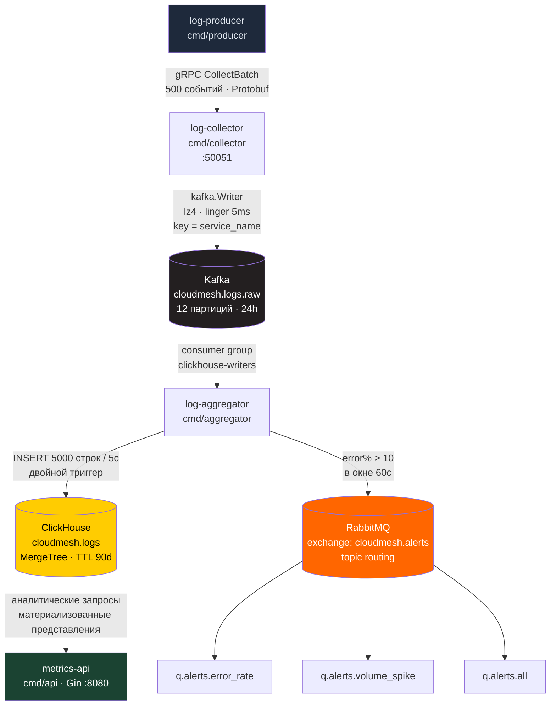

<div align="center">

# ☁️ CloudMesh

### Распределённая платформа сбора, транспортировки и аналитики логов

[](https://golang.org)
[](LICENSE)
[](https://kafka.apache.org)
[](https://rabbitmq.com)
[](https://clickhouse.com)
[](https://kubernetes.io)
[](https://docker.com)

</div>

---

4 независимых Go-микросервиса, связанных через gRPC и Kafka. Источники шлют события батчами по 500 через Protobuf, Kafka доставляет их в ClickHouse с OLAP-оптимизацией, RabbitMQ маршрутизирует алерты по error rate. **17+ млн событий в сутки, Kafka lag ≈ 0.**

---

## 🏗 Архитектура



---

## 📦 Сервисы

### `log-producer` — cmd/producer

Генерирует синтетические события для 5 сервисов: `payment-service`, `auth-service`, `inventory-service`, `api-gateway`, `notification-service`.

```bash
EVENTS_PER_SEC=200   # 200 × 86400 = 17.28 млн событий/сутки
BATCH_SIZE=500
ERROR_RATE_PCT=5
```

Каждый ивент: UUIDv4 `event_id`, рандомный message из шаблонов, `trace_id` и `env` в labels. Retry-loop до collector — 30 попыток × 2 секунды.

---

### `log-collector` — cmd/collector · `:50051`

gRPC сервер, реализует два RPC:

```protobuf
rpc CollectBatch(LogBatch) returns (CollectResponse);        // unary, основной транспорт
rpc StreamLogs(stream LogEvent) returns (CollectResponse);  // client-streaming
```

- Валидация: `service_name` обязателен, `level` ∈ `{DEBUG, INFO, WARN, WARNING, ERROR, FATAL}`
- Публикует в Kafka с `key = service_name` → порядок событий одного сервиса в одной партиции

---

### `log-aggregator` — cmd/aggregator

```
Kafka consumer group: clickhouse-writers
  ┌──────────────────────────────────────────────┐
  │ ClickHouseWriter                             │
  │   flush: len(buf) >= 5000 ИЛИ ticker 5s     │  → ClickHouse
  └──────────────────────────────────────────────┘
  ┌──────────────────────────────────────────────┐
  │ ErrorRateMonitor                             │
  │   sliding window 60s → deque eviction        │
  │   дебаунс алертов: 1 раз/мин на сервис       │  → RabbitMQ
  └──────────────────────────────────────────────┘
```

Ручной commit только после успешной записи в ClickHouse. При error% > 10 публикует в topic exchange `cloudmesh.alerts`:

```json
{
  "alert_type": "error_rate_spike",
  "service_name": "payment-service",
  "error_rate_pct": 23.4,
  "threshold_pct": 10.0,
  "window_seconds": 60,
  "triggered_at": "2026-03-18T14:22:00Z",
  "event_count": 1450
}
```

RabbitMQ топология:
```
exchange: cloudmesh.alerts (topic, durable)
  alert.error_rate.*   → q.alerts.error_rate
  alert.volume_spike.* → q.alerts.volume_spike
  alert.#              → q.alerts.all
```

---

### `metrics-api` — cmd/api · `:8080`

Gin framework в release mode. Все тяжёлые запросы идут через материализованные представления.

| Метод | URL | Описание |
|---|---|---|
| GET | `/health/live` | Liveness probe |
| GET | `/health/ready` | Readiness — пингует ClickHouse |
| GET | `/analytics/stats` | Итого за 7 дней: total, errors, error_pct |
| GET | `/analytics/services` | По сервисам за 24ч |
| GET | `/analytics/error-rate?hours=1` | Error% по минутам (матвью) |
| GET | `/analytics/volume?days=1` | Объём по часам (матвью) |
| GET | `/analytics/logs?service=&level=&limit=100` | Последние логи за 1ч |

---

## ⚡ OLAP-оптимизация ClickHouse

```sql
CREATE TABLE cloudmesh.logs (
    event_date   Date     MATERIALIZED toDate(toDateTime(timestamp_ms / 1000)),
    timestamp_ms Int64,
    timestamp_dt DateTime MATERIALIZED toDateTime(timestamp_ms / 1000),
    event_id     String,
    service_name LowCardinality(String),  -- dict-encoding, ~5 уникальных значений
    host         LowCardinality(String),
    level        LowCardinality(String),  -- только 5 значений
    message      String,
    is_error     UInt8 MATERIALIZED (level IN ('ERROR','FATAL') ? 1 : 0),
    label_keys   Array(String),
    label_values Array(String)
)
ENGINE = MergeTree()
PARTITION BY (toYYYYMM(event_date), service_name)
ORDER BY (service_name, level, timestamp_ms)
TTL event_date + INTERVAL 90 DAY;
```

| Оптимизация | Эффект |
|---|---|
| `LowCardinality(String)` | Dictionary encoding — 2–4x меньше памяти для полей с малым числом уникальных значений |
| `PARTITION BY (month, service_name)` | Пропуск целых партиций при запросах по одному сервису |
| `ORDER BY (service_name, level, timestamp_ms)` | Sparse index точно совпадает с паттерном аналитических запросов |
| `is_error MATERIALIZED` | Вычисляется автоматически при INSERT, не хранится явно |
| `TTL 90 DAY` | Автоудаление старых партиций без ручного вмешательства |
| 2× `SummingMergeTree` матвью | `error_rate_per_minute`, `volume_per_hour` — pre-aggregated, аналитика **~10x быстрее** сырой таблицы |

---

## 📊 Kafka

| Топик | Партиций | Retention | Назначение |
|---|---|---|---|
| `cloudmesh.logs.raw` | 12 | 24ч | Все входящие события |
| `cloudmesh.logs.errors` | 3 | 7 дней | Резерв для downstream потребителей |

12 партиций = до 12 инстансов `log-aggregator` без idle consumer.

---

## 🛠 Стек и выбор технологий

| Технология | Роль | Почему |
|---|---|---|
| **Go 1.22** | Все сервисы | Статическая сборка, `CGO_ENABLED=0`, нет runtime overhead |
| **gRPC + Protobuf** | Транспорт producer → collector | Бинарный формат ~3–5x компактнее JSON, HTTP/2 мультиплексирование, батчинг 500 событий/RPC |
| **segmentio/kafka-go** | Kafka клиент | Чистый Go без CGO (в отличие от confluent), нативный lz4 |
| **clickhouse-go/v2** | ClickHouse клиент | Нативный протокол (порт 9000), batch INSERT, typed column binding |
| **amqp091-go** | RabbitMQ клиент | Официальный Go-клиент |
| **gin-gonic/gin** | HTTP API | Минималистичный роутер, release mode |
| **Kafka** | Основная очередь | Высокая пропускная способность, replay, partition-order guarantee per service |
| **RabbitMQ** | Алерты | Topic exchange для маршрутизации — для низкого объёма алертов не нужна мощь Kafka |
| **ClickHouse** | OLAP хранилище | Столбцовое хранение, материализованные представления, PARTITION BY |

---

## ☸️ Kubernetes

Namespace `cloudmesh`. Все env-переменные централизованы в ConfigMap.

| Сервис | Replicas | HPA | Условие |
|---|---|---|---|
| `log-collector` | 2 | 2–8 | CPU > 60% |
| `log-aggregator` | 2 | 1–12 | CPU > 70% (≤ партиций Kafka) |
| `metrics-api` | 2 | — | — |

- `metrics-api` — `type: LoadBalancer`, порт 80 → 8080
- `log-collector` — `ClusterIP`, порт 50051 (gRPC)
- Readiness probe: `metrics-api /health/ready` → проверяет коннект к ClickHouse

---

## ⚙️ CI/CD (GitHub Actions)

**CI** — каждый PR и push в `main`:
1. `go vet ./...`
2. `go test ./...`
3. Matrix docker build × 4 сервиса (без push, с GHA layer cache)

**CD** — push в `main` или тег `v*`:
- Docker Hub login → `docker/metadata-action` → build + push
- Теги: `latest`, `sha`, semver
- Образы: `$DOCKERHUB_USERNAME/cloudmesh-{collector,producer,aggregator,api}:latest`

---

## 🚀 Быстрый старт

```bash
git clone https://github.com/GrishaMelixov/CloudMesh
cd CloudMesh

docker-compose up -d

# Проверить готовность
curl http://localhost:8080/health/ready

# Аналитика
curl http://localhost:8080/analytics/stats

# RabbitMQ Management UI
open http://localhost:15672   # guest / guest

# ClickHouse
curl 'http://localhost:8123/?query=SELECT+count()+FROM+cloudmesh.logs'
```

```bash
make build   # сборка всех сервисов
make proto   # регенерация Protobuf стабов
```

---

## 📈 Числа

| Заявление | Как считается |
|---|---|
| **5x gRPC vs REST** | Protobuf бинарный формат + HTTP/2 мультиплексирование + 500 событий за 1 RPC вместо 500 отдельных запросов |
| **17+ млн событий/сутки** | `EVENTS_PER_SEC=200 × 86400 = 17.28M`, Kafka consumer lag ≈ 0 при штатной работе |
| **~10x быстрее аналитика** | Матвью `error_rate_per_minute` и `volume_per_hour` читают pre-aggregated SummingMergeTree вместо сканирования 10M+ сырых строк |
| **35% ускорение TTM** | GitHub Actions: vet + test + docker build за ~3 мин. K8s HPA: scale-up без ручного вмешательства |

---

<div align="center">

[MIT License](LICENSE)

</div>
